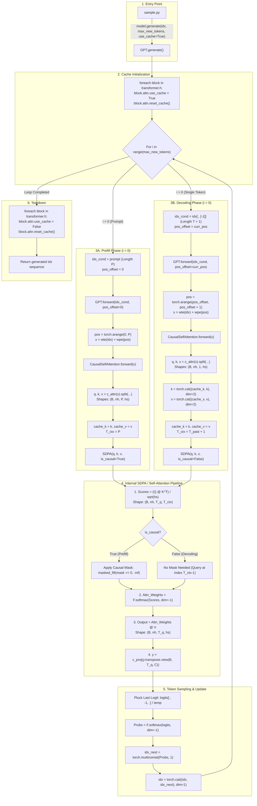

# Quick Interview Revision Notes: KV Caching in LLMs & nanoGPT

---

## 1. Core Elevator Pitch (What & Why?)
* **Problem**: In autoregressive LLM decoding, generating token $T+1$ recomputes Key ($K$) and Value ($V$) projections for all past $1..T$ tokens.
* **Complexity without KV Cache**: $O(T^2)$ total compute across $T$ generated tokens.
* **KV Cache Solution**: Store computed $K$ and $V$ tensors from past tokens in GPU memory. For new tokens, compute $Q, K, V$ for **only 1 token** ($T=1$), concatenate new $K, V$ to cache, and attend over the cached context.
* **Complexity with KV Cache**: $O(T)$ compute per generated token (Decouples decoding time from sequence history length).
* **Trade-off**: Saves **Compute (FLOPs)** at the cost of **GPU Memory (VRAM)**.

---

## 2. Complete Function Call & Execution Flow Diagram



### Detailed Call Hierarchy (Text Diagram)

```
sample.py
  └── model.generate(idx, max_new_tokens, use_cache=True)   [GPT.generate]
        │
        ├── 1. INIT:
        │     └── foreach block: block.attn.use_cache = True, block.attn.reset_cache()
        │
        ├── 2. PREFILL STEP (i = 0):
        │     ├── idx_cond = prompt (Shape: B x P)
        │     ├── pos_offset = 0
        │     ├── Call GPT.forward(idx_cond, pos_offset=0)
        │     │     ├── pos = torch.arange(0, P) -> shape (P)
        │     │     ├── tok_emb = wte(idx), pos_emb = wpe(pos)
        │     │     └── Block.forward(x) -> CausalSelfAttention.forward(x)
        │     │           ├── q, k, v = c_attn(x).split(n_embd, dim=2)   (T = P)
        │     │           ├── cache_k = k, cache_v = v                  (Store P tokens)
        │     │           ├── T_ctx = k.size(2) = P
        │     │           ├── is_causal = (T == T_ctx) = True
        │     │           └── y = scaled_dot_product_attention(q, k, v, is_causal=True)
        │     ├── Logit extraction: logits[:, -1, :]
        │     ├── Token sampling: torch.multinomial(probs, 1) -> idx_next
        │     └── Concatenation: idx = torch.cat((idx, idx_next), dim=1)
        │
        ├── 3. DECODING STEPS (i = 1 .. max_new_tokens - 1):
        │     ├── idx_cond = idx[:, [-1]]  (Shape: B x 1)
        │     ├── pos_offset = curr_pos
        │     ├── Call GPT.forward(idx_cond, pos_offset=curr_pos)
        │     │     ├── pos = torch.arange(pos_offset, pos_offset + 1) -> shape (1)
        │     │     ├── tok_emb = wte(idx), pos_emb = wpe(pos)
        │     │     └── Block.forward(x) -> CausalSelfAttention.forward(x)
        │     │           ├── q, k, v = c_attn(x).split(n_embd, dim=2)   (T = 1)
        │     │           ├── k = torch.cat((cache_k, k), dim=2)         (Append to past)
        │     │           ├── v = torch.cat((cache_v, v), dim=2)
        │     │           ├── cache_k = k, cache_v = v
        │     │           ├── T_ctx = T_past + 1
        │     │           ├── is_causal = (1 == T_ctx) = False
        │     │           └── y = scaled_dot_product_attention(q, k, v, is_causal=False)
        │     ├── Logit extraction: logits[:, -1, :]
        │     ├── Token sampling: torch.multinomial(probs, 1) -> idx_next
        │     └── Concatenation: idx = torch.cat((idx, idx_next), dim=1)
        │
        └── 4. TEARDOWN:
              └── foreach block: block.attn.use_cache = False, block.attn.reset_cache()
```

---

## 3. Prefill vs. Decoding Phase

| Phase | Input Shape ($X$) | Time Dim ($T$) | Causal Mask | Output Logits |
| :--- | :--- | :--- | :--- | :--- |
| **Prefill** (Prompt) | `(B, P, C)` | $P$ (Prompt Length) | `is_causal = True` | `(B, P, Vocab)` |
| **Decoding** (Token Generation) | `(B, 1, C)` | $1$ (Single Token) | `is_causal = False` | `(B, 1, Vocab)` |

---

## 4. Tensor Shapes in Multi-Head Attention

For Batch $B$, Heads $nh$, Head Dim $hs$, Prompt $P$, Cached Tokens $T_{ctx}$:

1. **Projection**: $Q, K, V = \text{Linear}(X)$
   - $Q \to (B, nh, 1, hs)$
   - $K_{new}, V_{new} \to (B, nh, 1, hs)$
2. **Cache Concatenation**:
   - $K_{cache} = \text{concat}([K_{past}, K_{new}], \text{dim}=2) \to (B, nh, T_{ctx}, hs)$
   - $V_{cache} = \text{concat}([V_{past}, V_{new}], \text{dim}=2) \to (B, nh, T_{ctx}, hs)$
3. **Attention Score Computation**:
   - $\text{Scores} = Q @ K_{cache}^T \to (B, nh, 1, T_{ctx})$
4. **Softmax & Value Reduction**:
   - $\text{Softmax}(\text{Scores}) @ V_{cache} \to (B, nh, 1, hs)$

---

## 5. Key PyTorch APIs & SDPA Step-by-Step Breakdown

### 5.1 Overview of APIs Used
1. **`torch.cat((cache_k, k), dim=2)`**: Appends new token key tensor along the sequence dimension.
2. **`torch.arange(pos_offset, pos_offset + t)`**: Generates continuous positional index for $W_{pe}$ lookup when forwarding single tokens.
3. **`F.scaled_dot_product_attention(q, k, v, is_causal=is_causal)`**:
   - `is_causal=True` during prefill ($T == T_{ctx}$).
   - `is_causal=False` during single-step decoding ($T=1 < T_{ctx}$) because token at $T_{ctx}-1$ must attend across all historical keys $0..T_{ctx}-1$.

---

### 5.2 What is SDPA (Scaled Dot-Product Attention)?

$$\text{SDPA}(Q, K, V) = \text{softmax}\left(\frac{Q K^T}{\sqrt{d_k}} + M\right) V$$

* **PyTorch API**: `torch.nn.functional.scaled_dot_product_attention(q, k, v, attn_mask=None, dropout_p=0.0, is_causal=False)`
* **Why SDPA over Manual Attention?**
  - **FlashAttention Integration**: PyTorch automatically dispatches SDPA to fused CUDA kernels (FlashAttention-1/2 or Memory-Efficient Attention).
  - **No $O(T^2)$ VRAM Allocation**: Computes attention in small tiles directly in GPU SRAM without materializing the $O(T^2)$ score matrix in main VRAM.
  - **Speed**: Up to **2x–4x faster** with significantly reduced memory bandwidth pressure.

---

### 5.3 Step-by-Step Manual Self-Attention Pipeline

For Query $Q \in \mathbb{R}^{B \times nh \times T_q \times hs}$, Key $K \in \mathbb{R}^{B \times nh \times T_{kv} \times hs}$, Value $V \in \mathbb{R}^{B \times nh \times T_{kv} \times hs}$:

```
  Q (B, nh, T_q, hs)       K (B, nh, T_kv, hs)
          │                        │
          │                   Transpose(-2, -1)
          │                        │
          │               K^T (B, nh, hs, T_kv)
          └───────────┬────────────┘
                      │
           Batch MatMul (Q @ K^T)
                      │
           Scores (B, nh, T_q, T_kv)
                      │
           Scale by 1 / sqrt(hs)
                      │
           Apply Mask (masked_fill)
                      │
           Softmax over dim=-1
                      │
        Attn Weights (B, nh, T_q, T_kv)       V (B, nh, T_kv, hs)
                      │                               │
                      └───────────────┬───────────────┘
                                      │
                           Batch MatMul (Attn @ V)
                                      │
                           Output Y (B, nh, T_q, hs)
```

#### Detailed Operations at Each Step

1. **Transpose Key Tensor**:
   - `k_t = k.transpose(-2, -1)` $\to$ Shape: `(B, nh, hs, T_kv)`
2. **Compute Raw Scores (Batch MatMul)**:
   - `scores = q @ k.transpose(-2, -1)` $\to$ Shape: `(B, nh, T_q, T_kv)`
3. **Scale Scores**:
   - `scores = scores * (1.0 / math.sqrt(hs))`
   - *Why?* Prevents dot product magnitudes from growing too large on large $hs$, avoiding vanishing gradients during softmax.
4. **Apply Masking**:
   - `scores = scores.masked_fill(mask == 0, float('-inf'))`
   - *Why $-\infty$?* $e^{-\infty} = 0$, so masked future positions receive 0% attention weight.
5. **Softmax Normalization**:
   - `attn_weights = F.softmax(scores, dim=-1)` $\to$ Shape: `(B, nh, T_q, T_kv)`
6. **Attention Dropout (Training Only)**:
   - `attn_weights = dropout(attn_weights)`
7. **Weighted Sum of Values (Batch MatMul)**:
   - `output = attn_weights @ v` $\to$ Shape: `(B, nh, T_q, hs)`
8. **Reshape & Project**:
   - `y = output.transpose(1, 2).contiguous().view(B, T_q, C)` followed by `self.c_proj(y)`.

---

### 5.4 Python Reference Implementation

```python
import math
import torch
import torch.nn.functional as F

def manual_scaled_dot_product_attention(q, k, v, mask=None, dropout_p=0.0, is_causal=False):
    # Scale factor 1 / sqrt(d_k)
    scale = 1.0 / math.sqrt(q.size(-1))
    
    # 1. Raw Dot Product Scores (B, nh, T_q, T_kv)
    scores = (q @ k.transpose(-2, -1)) * scale
    
    # 2. Apply Causal Mask if required
    if is_causal:
        T_q, T_kv = q.size(2), k.size(2)
        causal_mask = torch.tril(torch.ones(T_q, T_kv, device=q.device)).bool()
        scores = scores.masked_fill(~causal_mask, float('-inf'))
    elif mask is not None:
        scores = scores.masked_fill(mask == 0, float('-inf'))
        
    # 3. Softmax Normalization
    attn_weights = F.softmax(scores, dim=-1)
    
    # 4. Dropout
    if dropout_p > 0.0:
        attn_weights = F.dropout(attn_weights, p=dropout_p)
        
    # 5. Weighted sum over Values (B, nh, T_q, hs)
    output = attn_weights @ v
    return output
```

---

## 6. Top 5 Interview Questions & Answers

### Q1: How do you calculate KV Cache Memory Usage?
$$\text{Memory (bytes)} = 2 \times \text{n\_layers} \times \text{n\_heads} \times \text{head\_dim} \times \text{seq\_len} \times \text{precision\_bytes} \times \text{batch\_size}$$
* *Example (GPT-2 124M)*: 12 layers, 12 heads, head_dim 64, fp16 (2 bytes):
  $$\approx 2 \times 12 \times 12 \times 64 \times 1024 \times 2 = 37.7 \text{ MB per sequence}$$

### Q2: What is the bottleneck during LLM inference?
* **Prefill Phase**: **Compute-bound** (large matrix-matrix multiplications).
* **Decoding Phase with KV Cache**: **Memory-Bandwidth bound** (fetching large KV cache from HBM/VRAM to GPU SRAM for single-token vector-matrix ops).

### Q3: What is wrong with using `torch.cat` for KV caching in production?
* `torch.cat` reallocates a new memory buffer on **every single token**, causing GPU memory fragmentation and allocation latency.
* **Fix**: Use **static pre-allocated KV cache buffers** or **PagedAttention (vLLM)**.

### Q4: Why is `is_causal=False` used during the decoding phase?
* When $T=1$ and $T_{ctx} > 1$, the query tensor has sequence length 1 (at index $T_{ctx}-1$).
* It needs to attend to all keys from index $0$ to $T_{ctx}-1$. Since there are no "future" tokens passed in $Q$, a causal triangular mask is unnecessary.

### Q5: What architectural innovations optimize KV Cache memory footprint?
1. **Multi-Query Attention (MQA)**: Share 1 key/value head across all query heads ($1/nh$ KV cache size).
2. **Grouped-Query Attention (GQA)**: Share 1 key/value head across $G$ query heads (used in Llama 2/3, Mistral).
3. **PagedAttention**: Manages KV cache in virtual memory blocks to eliminate fragmentation.
4. **Quantization**: FP8 / INT4 KV cache quantization.

---

## 7. nanoGPT Implementation Cheat-Sheet

* **State**: `self.use_cache`, `self.cache_k`, `self.cache_v` in `CausalSelfAttention`.
* **Offset**: `pos_offset` in `GPT.forward()` for position embedding lookup `wpe(pos_offset)`.
* **Loop**: `GPT.generate()` runs prompt prefill at step `i=0`, then passes `idx[:, [-1]]` with `pos_offset = curr_pos` for `i > 0`.
* **Reset**: `reset_cache()` called before and after generation to prevent memory leakage.
